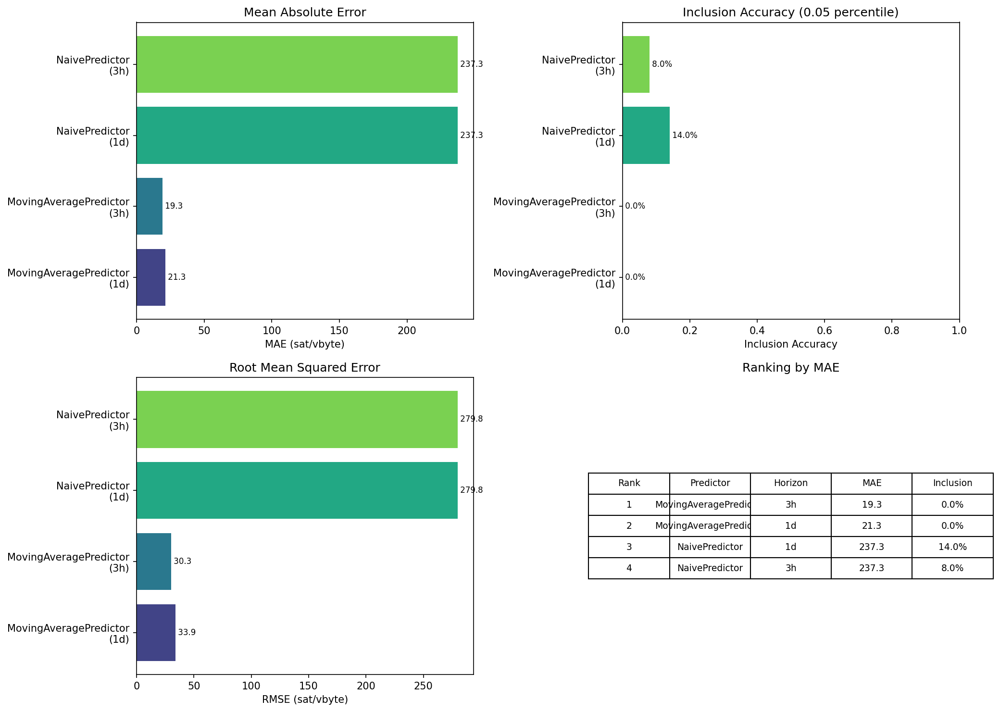
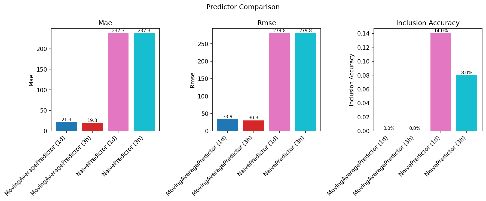
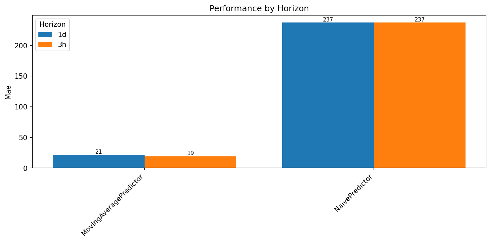

# Predictor Comparison Report

Generated: 2026-02-11 11:13:47

## Summary

| Predictor | Horizon | MAE | RMSE | Inclusion | Dataset |
|-----------|---------|-----|------|-----------|---------|
| MovingAveragePredictor | 3h | 19.35 | 30.32 | 0.0% | high_fees_20171215_20171222 |
| MovingAveragePredictor | 1d | 21.35 | 33.85 | 0.0% | high_fees_20171215_20171222 |
| NaivePredictor | 1d | 237.29 | 279.77 | 14.0% | high_fees_20171215_20171222 |
| NaivePredictor | 3h | 237.29 | 279.77 | 8.0% | high_fees_20171215_20171222 |

## Best Performers

**Lowest MAE:** MovingAveragePredictor (3h) - 19.35 sat/vbyte
**Highest Inclusion:** NaivePredictor (1d) - 14.0%

## Visualizations

### Overall Comparison

### Metrics Breakdown

### Performance by Horizon

## Individual Results

### MovingAveragePredictor (1d)

- **Dataset:** high_fees_20171215_20171222
- **Split:** test
- **Snapshots:** 50
- **Criterion:** 0.05_percentile

**Parameters:**
- horizon: 1d
- window: 500

**Metrics:**
- mae: 21.3455
- rmse: 33.8522
- directional_accuracy: 54.00%
- mean_prediction: 358.6671
- std_prediction: 29.4869
- inclusion_accuracy: 0.00%
- n_included: 0

### MovingAveragePredictor (3h)

- **Dataset:** high_fees_20171215_20171222
- **Split:** test
- **Snapshots:** 50
- **Criterion:** 0.05_percentile

**Parameters:**
- horizon: 3h
- window: 100

**Metrics:**
- mae: 19.3467
- rmse: 30.3184
- directional_accuracy: 66.00%
- mean_prediction: 362.0833
- std_prediction: 39.3881
- inclusion_accuracy: 0.00%
- n_included: 0

### NaivePredictor (1d)

- **Dataset:** high_fees_20171215_20171222
- **Split:** test
- **Snapshots:** 50
- **Criterion:** 0.05_percentile

**Parameters:**
- horizon: 1d
- method: last_value

**Metrics:**
- mae: 237.2944
- rmse: 279.7692
- directional_accuracy: 38.00%
- mean_prediction: 387.4400
- std_prediction: 279.5750
- inclusion_accuracy: 14.00%
- n_included: 7

### NaivePredictor (3h)

- **Dataset:** high_fees_20171215_20171222
- **Split:** test
- **Snapshots:** 50
- **Criterion:** 0.05_percentile

**Parameters:**
- horizon: 3h
- method: last_value

**Metrics:**
- mae: 237.2944
- rmse: 279.7692
- directional_accuracy: 38.00%
- mean_prediction: 387.4400
- std_prediction: 279.5750
- inclusion_accuracy: 8.00%
- n_included: 4

## Methodology

### Inclusion Criterion

A prediction is considered successful if it exceeds the **0.05 percentile** 
(5th percentile) of actual fee rates in the target block. This filters out 
anomalous low-fee transactions (miner payouts, CPFP, consolidation) that 
don't reflect true fee market dynamics.
